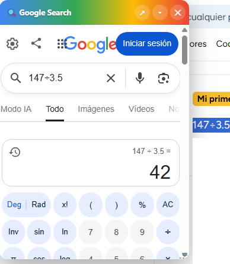

# Brainly Enhancer

**Última Actualización:** 14 de julio de 2026

Añade un buscador de Google integrado y miniaturas automáticas de imágenes adjuntas en Brainly. Incluye una ventana flotante movible, redimensionable, colapsable y con posición guardada automáticamente.

## 📖 Descripción

**Brainly Enhancer** es un UserScript para **Tampermonkey** que mejora la experiencia de navegación en Brainly mediante dos funciones principales.

La primera permite buscar cualquier texto seleccionado directamente en Google desde una ventana flotante integrada, sin abandonar la página.

La segunda detecta automáticamente publicaciones con imágenes adjuntas y muestra una miniatura directamente en el feed, permitiendo abrir la imagen completa con un solo clic.

Todo funciona automáticamente y está integrado de forma nativa en la interfaz de Brainly.

---

# 📥 Instalación

1. Instala la extensión **Tampermonkey** en tu navegador.

2. Instala el script desde GitHub:

**➡️ [Instalar Script](https://github.com/wernser412/Google-Search-on-Brainly/raw/refs/heads/main/Google%20Search%20in%20Movable%20%26%20Resizable%20Box%20on%20Brainly.user.js)**

---

# ✨ Características

- 🔍 Buscar cualquier texto seleccionado directamente en Google.
- 🪟 Ventana flotante integrada.
- 🖱️ Ventana movible mediante arrastrar y soltar.
- 📏 Ventana redimensionable.
- 📂 Posibilidad de colapsar y expandir la ventana.
- 💾 Guarda automáticamente posición, tamaño y estado.
- 🌐 Abrir la búsqueda en una pestaña nueva.
- 📎 Miniaturas automáticas para imágenes adjuntas.
- 🖼️ Vista previa integrada dentro del feed.
- 🖱️ Abrir la imagen completa con un clic.
- ⚡ Caché de miniaturas para mejorar el rendimiento.
- 🔄 Compatible con el contenido dinámico de Brainly.
- ⌨️ Cierre rápido de la ventana mediante la tecla **Esc**.

---

# 🖥️ Uso

## 🔍 Google Search

1. Selecciona cualquier texto dentro de Brainly.
2. Aparecerá un pequeño icono de Google junto a la selección.
3. Haz clic sobre el icono.
4. Se abrirá la ventana flotante con los resultados.
5. Puedes moverla, cambiar su tamaño, colapsarla o abrir la búsqueda en una pestaña nueva.

---

## 📎 Miniaturas

Las publicaciones que contengan imágenes adjuntas mostrarán automáticamente una vista previa.

Solo debes hacer clic sobre la miniatura para abrir la imagen completa.

---

# 🪟 Ventana flotante

La ventana integrada permite:

- 🔍 Consultar resultados de Google sin salir de Brainly.
- 🖱️ Arrastrarla a cualquier posición.
- 📏 Cambiar su tamaño.
- 📂 Colapsarla cuando no se utilice.
- 💾 Recordar automáticamente su posición y dimensiones.

---

# 📎 Miniaturas automáticas

Las miniaturas incluyen:

- 🖼️ Vista previa de la imagen.
- 📎 Indicador visual de adjunto.
- ⚡ Carga automática.
- 💾 Caché para evitar volver a descargar imágenes ya vistas.

---

# 📄 Sitio compatible

Actualmente el script funciona en:

- Brainly

---

# 📄 Licencia

Este proyecto se distribuye bajo la licencia **MIT**.

Consulta el archivo **LICENSE** para más información.
